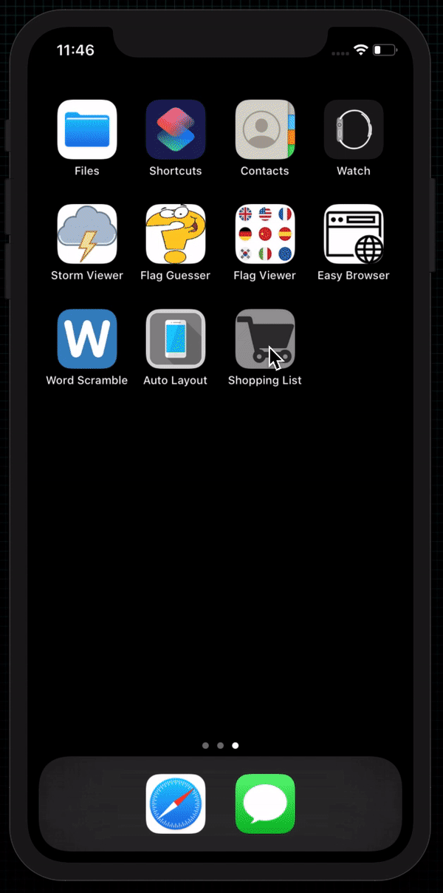

# Shopping List

  

 
An application that lets people create a shopping list by adding items to a table view.

## Examples within this code
- Reloading table views
- Inserting rows into tables
- UIToolbar
- Swipe to delete gesture
- Text input in alerts
- Closures
- NSRange

## Demonstration
Small demonstration as to what the application does when on device.
 

